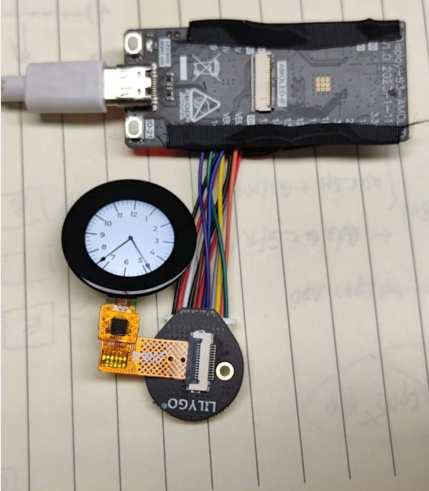

This is a tool for testing round screens:

触摸屏的脚位如下 
~~~
 * LEDA  --- 18        背光
 * RESET --- 8
 * RS    --- 17
 * SDA   --- 11
 * SCL   --- 13
 * CS    --- 10
 * 
 * TP_RST --- 15
 * TP_SCL --- 6
 * TP_SDA --- 5
 * TP_INT --- 7
~~~